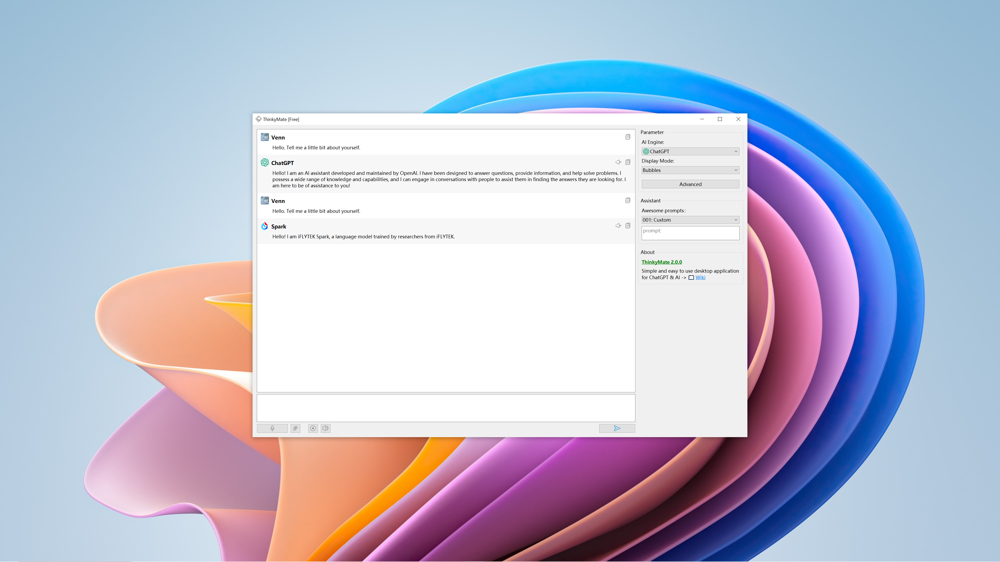

  

      <h1>
      
    </h1>
     
    <h4>Simple and easy to use desktop application for ChatGPT & AI</h4>
    <h4>简洁且易用的 ChatGPT & AI 的桌面应用程序</h4>
    <h4>簡潔且易用的 ChatGPT & AI 的桌面應用程序</h4>
  

  
 <a href="index.md">English</a> | <a href="index.zh_CN.md">简体中文</a>

## Preview

## Features

**Celebrate with the release of the official first version v1.0.0!** 🎉🎉🎉🎊🎊🎊

**ChatGPT & AI:**

- Support speech-to-text direct questioning speech-to-text (STT)
- Support ChatGPT and SparkDesk AI Model
- Support text to speech function text-to-speech (TTS)
- Support display mode switching: streaming (typewriter) + regular response
- Support theme change: MacOS, Ubuntu, Windows, Diablo mode
- API Key encryption by AES_256 + CBC algorithm, password box input
- Cross-platform support (Windows, MacOS, Linux OS)

**Voice:**

- Support hardware HeadSet headset linkage extension
- Support automatic intelligent phrase and conversion, more fluent and natural
- Support modifying speech speed and replacing voice library

## Tutorials

1. [Download](https://github.com/XMuli/ThinkyMatePages/releases) the package and install it
2. Tray Mail context menu, open Advanced Settings
3. Enter the API KEY to enable the corresponding functions, which are optional; please restart the software to ensure that it takes effect.
   - Enter the OpenAI Key to use the ChatGPT feature and the speech-to-text feature
   - Enter XunFei Key to use SparkDesk function
   - Enter BaiDu Key to use the text-to-speech function
4. Enter your voice or text and enjoy using ChatGPT features!
5. For more preview images see [here](https://github.com/XMuli/ThinkyMatePages/docs/snapshoot/)

## Great

If it helps you, or find it useful,  **you can click on the item's ⭐Star 🍴 Fork  of the two icons, conveniently lift the hand between, said a point of praise the hand,** There is a fragrance in your hand；The next best thing is to buy me a cold Coke.  

## Feedback

How to Feedback ? You are very welcome to join us! You can [open an issue](https://github.com/XMuli/ThinkyMatePages/issues) ; for any bug, suggestion, feature idea, or to help improve this software.

## Author

xmulitech@gmail.com    |    https://thinkymate.com

## More

When I think of it, I'll add it here or on the wiki.

