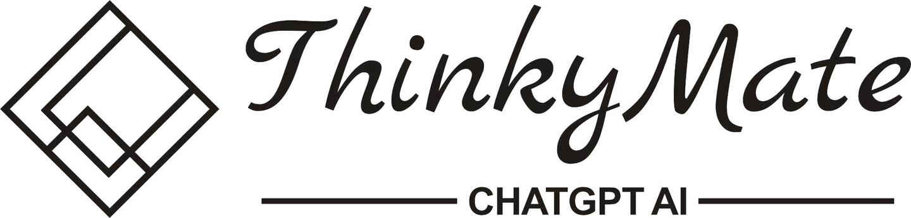
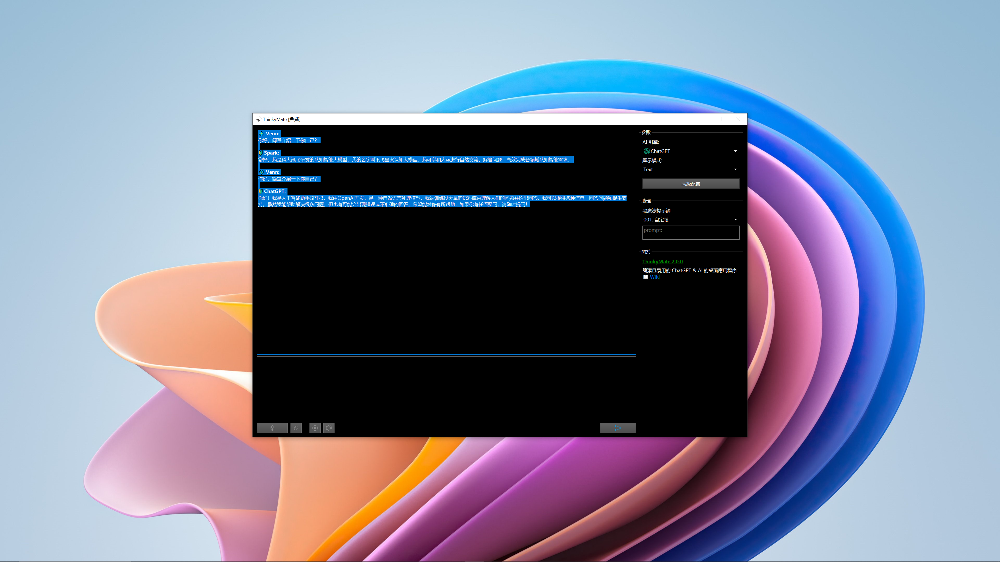

  

      <h1>
      
    </h1>
     
    <h4>Simple and easy to use desktop application for ChatGPT & AI</h4>
    <h4>简洁且易用的 ChatGPT & AI 的桌面应用程序</h4>
    <h4>簡潔且易用的 ChatGPT & AI 的桌面應用程序</h4>
  

  
 <a href="index.md">English</a> | <a href="index.zh_CN.md">简体中文</a>

## Preview

